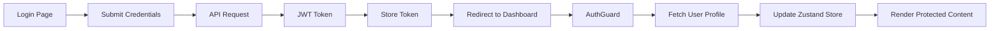
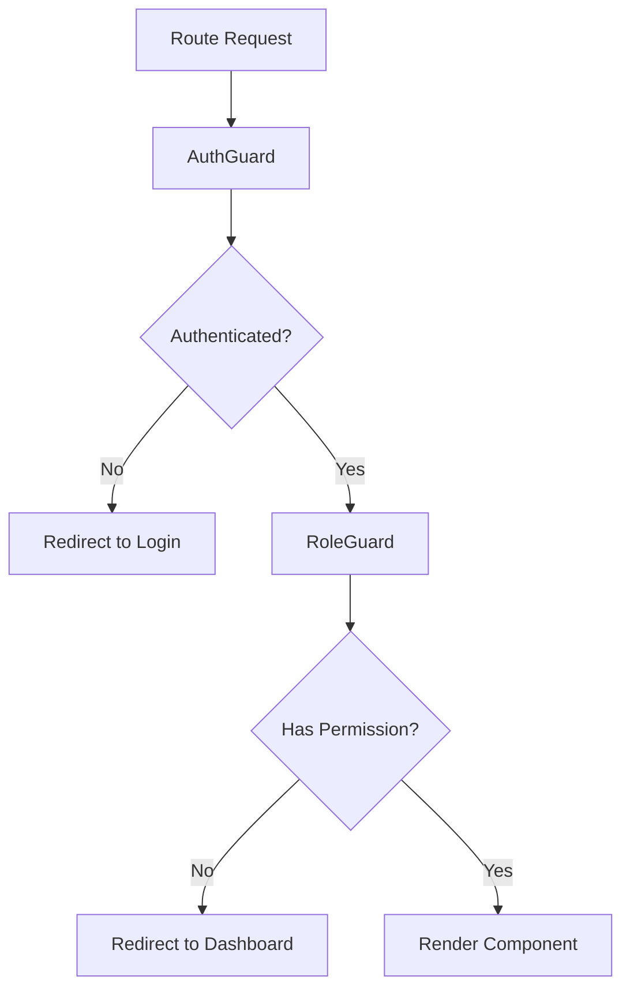

# Documentación Técnica de Arquitectura - La Base Cowork

## 📋 Resumen de Arquitectura

**La Base Cowork** implementa una **arquitectura modular orientada a features** en el frontend, siguiendo principios de **Clean Architecture** y **separación de responsabilidades**. La aplicación está construida con React 19 y TypeScript, utilizando un enfoque moderno de desarrollo con herramientas como Vite, TailwindCSS y shadcn/ui.

### Principios Arquitectónicos Aplicados

- **Separación de Responsabilidades**: Cada módulo tiene una responsabilidad específica
- **Desacoplamiento**: Componentes independientes con interfaces bien definidas
- **Reutilización**: Componentes y hooks reutilizables
- **Mantenibilidad**: Estructura clara y documentada
- **Escalabilidad**: Arquitectura preparada para crecimiento
- **Testabilidad**: Componentes aislados y testeable

## 🏗️ Diagrama de Arquitectura

```
┌─────────────────────────────────────────────────────────────────┐
│                    NAVEGADOR / CLIENTE                          │
└─────────────────────────┬───────────────────────────────────────┘
                          │
┌─────────────────────────▼───────────────────────────────────────┐
│                  CAPA DE PRESENTACIÓN                           │
├─────────────────────────────────────────────────────────────────┤
│  React Components (Pages, Layouts, UI Components)              │
│  ├── Guards (Auth, Role, Guest)                                │
│  ├── Layouts (Core, Sidebar)                                   │
│  └── UI Components (shadcn/ui)                                 │
└─────────────────────────┬───────────────────────────────────────┘
                          │
┌─────────────────────────▼───────────────────────────────────────┐
│                  CAPA DE LÓGICA DE NEGOCIO                     │
├─────────────────────────────────────────────────────────────────┤
│  Custom Hooks (useAuth, useTitle)                              │
│  ├── Estado Global (Zustand Store)                             │
│  ├── Gestión de Datos (React Query)                            │
│  └── Routing (React Router DOM)                                │
└─────────────────────────┬───────────────────────────────────────┘
                          │
┌─────────────────────────▼───────────────────────────────────────┐
│                  CAPA DE SERVICIOS                             │
├─────────────────────────────────────────────────────────────────┤
│  API Services (HTTP Requests)                                  │
│  ├── Axios Interceptors                                        │
│  ├── Error Handling                                            │
│  └── Request/Response Transformations                          │
└─────────────────────────┬───────────────────────────────────────┘
                          │
┌─────────────────────────▼───────────────────────────────────────┐
│                  CAPA DE INFRAESTRUCTURA                       │
├─────────────────────────────────────────────────────────────────┤
│  Configuration (Environment Variables)                         │
│  ├── Utilities (Error Messages, Query Client)                 │
│  ├── Types (TypeScript Interfaces)                            │
│  └── Build Tools (Vite, ESLint, TypeScript)                   │
└─────────────────────────┬───────────────────────────────────────┘
                          │
┌─────────────────────────▼───────────────────────────────────────┐
│                     API BACKEND                                │
│                 (External Service)                             │
└─────────────────────────────────────────────────────────────────┘
```

## 🏢 Estructura Modular Detallada

### 1. **Módulos por Feature**

La aplicación está organizada en módulos funcionales independientes:

```
src/modules/
├── admin/                    # Funcionalidades de administración
│   ├── calendar/
│   │   └── features/
│   │       └── view_calendar/
│   │           └── pages/
│   │           └── features/
│   └── reservations/
│       └── features/
│           ├── scan_qr_reservations/
│           ├── view_all_reservations/
│           └── view_reservation/
├── client/                   # Funcionalidades de cliente
│   └── reservations/
│       └── features/
│           ├── create_reservations/
│           ├── view_reservation/
│           └── view_reservations/
└── shared/                   # Módulos compartidos
    ├── auth/
    │   └── features/
    │       ├── login/
    │       ├── register/
    │       ├── recover_password/
    │       └── change_password/
    └── error/
        └── features/
            ├── internal_error/
            └── not_found/
```

### 2. **Componentes Arquitectónicos**

#### **Guards** - Control de Acceso

```typescript
// Jerarquía de Guards
AuthGuard     → Verifica autenticación
├── RoleGuard → Verifica permisos por rol
└── GuestGuard → Rutas para usuarios no autenticados
```

#### **Layouts** - Estructura Visual

```typescript
Core        → Proveedor de React Query
└── Sidebar → Layout principal con navegación
```

#### **Routing** - Navegación

```typescript
Router
├── authRoutes   → /login, /register, /recover-password
├── appRoutes    → Rutas protegidas
│   ├── clientRoutes → /client/*
│   └── adminRoutes  → /admin/*
└── errorRoutes  → /404, /500
```

## 🔄 Flujo de Datos y Comunicación

### 1. **Flujo de Autenticación**



### 2. **Flujo de Navegación**



### 3. **Flujo de Datos API**

```mermaid
graph LR
    A[Component] --> B[Custom Hook]
    B --> C[React Query]
    C --> D[API Service]
    D --> E[Axios Interceptor]
    E --> F[Add Auth Token]
    F --> G[HTTP Request]
    G --> H[Backend API]
    H --> I[Response]
    I --> J[Error Handling]
    J --> K[Update Cache]
    K --> L[Re-render Component]
```



## 🛠️ Capas de la Arquitectura

### **Capa de Presentación**

**Responsabilidad**: Renderizado de UI y manejo de interacciones del usuario

#### Componentes Principales:

- **Pages**: Componentes que representan páginas completas
- **Layouts**: Estructuras de página reutilizables
- **UI Components**: Componentes de interfaz basados en shadcn/ui
- **Guards**: Componentes de control de acceso

#### Tecnologías:

- React 19 (Concurrent Features)
- TypeScript (Tipado estático)
- TailwindCSS (Styling)
- shadcn/ui (Component Library)
- Lucide React (Icons)

### **Capa de Lógica de Negocio**

**Responsabilidad**: Gestión de estado, lógica de aplicación y reglas de negocio

#### Componentes Principales:

- **Custom Hooks**: Encapsulan lógica reutilizable
- **Zustand Store**: Gestión de estado global
- **React Query**: Gestión de datos asíncronos
- **React Router**: Navegación y routing

#### Patrones Aplicados:

- **Custom Hooks Pattern**: Reutilización de lógica
- **Observer Pattern**: Suscripción a cambios de estado
- **Command Pattern**: Acciones de estado centralizadas

### **Capa de Servicios**

**Responsabilidad**: Comunicación con APIs externas y transformación de datos

#### Componentes Principales:

- **API Services**: Funciones para comunicación HTTP
- **Axios Interceptors**: Manejo automático de tokens y errores
- **Error Utilities**: Transformación de errores en mensajes user-friendly
- **Type Definitions**: Contratos de datos con el backend

#### Características:

- **Interceptors automáticos** para autenticación
- **Manejo centralizado de errores**
- **Transformación de datos** entrada/salida
- **Retry logic** para requests fallidos

### **Capa de Infraestructura**

**Responsabilidad**: Configuración, utilidades y herramientas de desarrollo

#### Componentes Principales:

- **Configuration**: Variables de entorno y configuración
- **Utilities**: Funciones helper y utilidades
- **Build Tools**: Vite, ESLint, TypeScript
- **Type System**: Definiciones de tipos globales

## 🔐 Sistema de Autenticación y Autorización

### **Arquitectura de Seguridad**

```typescript
// Flujo de Autenticación
interface AuthFlow {
  1. Login → JWT Token
  2. Token Storage → localStorage
  3. Axios Interceptor → Auto-attach token
  4. Route Guards → Protect routes
  5. Role Guards → Permission checking
  6. Auto-refresh → Token renewal
}
```

### **Implementación de Guards**

```typescript
// AuthGuard - Protege rutas autenticadas
const AuthGuard = () => {
  const { token, user, isPending, isError } = useAuth();

  if (!token || isError) {
    return <Navigate to="/login" />;
  }

  if (isPending) return <LoaderSplash />;

  return <Outlet />;
};

// RoleGuard - Controla acceso por roles
const RoleGuard = () => {
  const { user } = useAuth();
  const location = useLocation();

  const canAccess = checkPermissions(user, location.pathname);

  if (!canAccess) {
    return <Navigate to={getDefaultRoute(user.role)} />;
  }

  return <Outlet />;
};
```

## 📊 Gestión de Estado

### **Zustand Store Architecture**

```typescript
// Estado Global Centralizado
interface AppState {
  user: UserState;
  ui: UIState;
  cache: CacheState;
}

// Store Modular
const useUserStore = create<UserStore>((set) => ({
  user: null,
  setUser: (user) => set({ user }),
  deleteUser: () => set({ user: null }),
}));
```

### **React Query Integration**

```typescript
// Gestión de Datos Asíncronos
const useAuth = () => {
  const { data, isLoading, error } = useQuery({
    queryKey: ["profile"],
    queryFn: getProfile,
    enabled: !!token,
    staleTime: 5 * 60 * 1000, // 5 minutos
  });

  return {
    user: data?.user,
    isLoading,
    error,
  };
};
```

## 🎨 Sistema de Diseño y Theming

### **TailwindCSS v4 Architecture**

```css
/* Sistema de Design Tokens */
@theme inline {
  --color-primary: var(--primary);
  --color-secondary: var(--secondary);
  --radius-sm: calc(var(--radius) - 4px);
  --radius-lg: var(--radius);
}

/* Soporte para Dark Mode */
.dark {
  --background: oklch(0.145 0 0);
  --foreground: oklch(0.985 0 0);
}
```

### **Component Variants System**

```typescript
// shadcn/ui + class-variance-authority
const buttonVariants = cva("inline-flex items-center justify-center", {
  variants: {
    variant: {
      default: "bg-primary text-primary-foreground",
      destructive: "bg-destructive text-destructive-foreground",
    },
    size: {
      default: "h-10 px-4 py-2",
      sm: "h-9 px-3",
      lg: "h-11 px-8",
    },
  },
});
```

## 🔍 Manejo de Errores y Logging

### **Error Boundaries Architecture**

```typescript
// Sistema de Manejo de Errores
interface ErrorHandling {
  HTTPErrors: "Interceptors + Custom Messages";
  UIErrors: "Error Boundaries + Fallback UI";
  ValidationErrors: "Form Validation + User Feedback";
  NetworkErrors: "Retry Logic + Offline Detection";
}
```

### **Utilidades de Error**

```typescript
// Mensajes de Error Personalizados
const getErrorMessageByStatus = (status: number) => {
  const messages = {
    400: "Solicitud incorrecta...",
    401: "No autorizado...",
    403: "Acceso prohibido...",
    404: "No encontrado...",
    500: "Error interno del servidor...",
  };

  return messages[status] || "Error desconocido";
};
```

## 📱 Responsive Design y Accesibilidad

### **Responsive Strategy**

```typescript
// Breakpoints TailwindCSS
const breakpoints = {
  sm: "640px", // Mobile
  md: "768px", // Tablet
  lg: "1024px", // Desktop
  xl: "1280px", // Large Desktop
};

// Diseño Mobile-First
const ResponsiveComponent = () => (
  <div className="grid grid-cols-1 md:grid-cols-2 lg:grid-cols-3">
    {/* Content */}
  </div>
);
```

### **Accesibilidad (a11y)**

```typescript
// Componentes Accesibles
interface AccessibilityFeatures {
  SemanticHTML: "Uso correcto de elementos HTML";
  ARIALabels: "Etiquetas descriptivas";
  KeyboardNavigation: "Navegación por teclado";
  ScreenReader: "Compatibilidad con lectores de pantalla";
  ColorContrast: "Contraste adecuado de colores";
}
```

## 🚀 Optimización y Performance

### **Estrategias de Optimización**

```typescript
// Code Splitting
const LazyComponent = lazy(() => import("./Component"));

// Memoización
const MemoizedComponent = memo(({ data }) => {
  return <ExpensiveComponent data={data} />;
});

// React Query Optimization
const useOptimizedQuery = () => {
  return useQuery({
    queryKey: ["data"],
    queryFn: fetchData,
    staleTime: 5 * 60 * 1000,
    cacheTime: 10 * 60 * 1000,
  });
};
```

### **Build Optimization**

```typescript
// Vite Configuration
export default defineConfig({
  build: {
    rollupOptions: {
      output: {
        manualChunks: {
          vendor: ["react", "react-dom"],
          router: ["react-router-dom"],
          ui: ["@radix-ui/react-slot"],
        },
      },
    },
  },
});
```

## 🧪 Testing Strategy

### **Testing Architecture**

```typescript
// Estrategia de Testing
interface TestingLayers {
  Unit: "Components individuales";
  Integration: "Flujos de usuario";
  E2E: "Casos de uso completos";
  Accessibility: "Pruebas a11y";
}

// Ejemplo de Test
describe("AuthGuard", () => {
  it("should redirect to login when not authenticated", () => {
    // Test implementation
  });
});
```

## 🔄 CI/CD y Deployment

### **Pipeline de Despliegue**

```yaml
# Ejemplo de Pipeline
stages:
  - install: npm ci
  - lint: npm run lint
  - test: npm run test
  - build: npm run build
  - deploy: Deploy to production
```

## 📋 Justificación del Stack Tecnológico

### **React 19**

- **Concurrent Features**: Mejor rendimiento con Suspense y Transitions
- **Server Components**: Preparado para SSR futuro
- **Automatic Batching**: Optimización automática de renders
- **Comunidad**: Amplio ecosistema y soporte

### **TypeScript**

- **Type Safety**: Detección temprana de errores
- **Developer Experience**: IntelliSense y refactoring
- **Maintainability**: Código más mantenible y documentado
- **Team Collaboration**: Interfaces claras entre desarrolladores

### **Vite**

- **Speed**: HMR ultrarrápido en desarrollo
- **Modern**: Soporte nativo para ES modules
- **Plugin Ecosystem**: Extensible y configurable
- **Build Optimization**: Rollup para producción

### **TailwindCSS**

- **Utility-First**: Desarrollo rápido de UI
- **Consistency**: Sistema de diseño coherente
- **Performance**: CSS optimizado y purgeado
- **Customization**: Altamente personalizable

### **shadcn/ui**

- **Accessibility**: Componentes accesibles por defecto
- **Customization**: Completamente personalizable
- **Modern**: Basado en Radix UI primitives
- **TypeScript**: Tipado completo

### **Zustand**

- **Simplicity**: API simple y minimalista
- **Performance**: Sin boilerplate innecesario
- **TypeScript**: Excelente soporte para tipos
- **Bundle Size**: Muy ligero comparado con Redux

### **React Query**

- **Caching**: Sistema de caché inteligente
- **Synchronization**: Sincronización automática
- **Background Updates**: Actualizaciones en segundo plano
- **DevTools**: Herramientas de desarrollo excelentes

## 🎯 Principios de Desarrollo

### **Clean Code Principles**

- **Single Responsibility**: Cada función/componente tiene una sola responsabilidad
- **DRY**: No repetir código
- **KISS**: Mantener la simplicidad
- **SOLID**: Principios de diseño orientado a objetos

### **React Best Practices**

- **Hooks**: Uso preferente de hooks sobre clases
- **Functional Components**: Componentes funcionales
- **Props Drilling**: Evitar con Context/Zustand
- **Memoization**: Optimización consciente

### **TypeScript Best Practices**

- **Strict Mode**: Configuración estricta
- **Interface over Type**: Preferir interfaces
- **Generic Types**: Reutilización de tipos
- **Utility Types**: Aprovechamiento de tipos utilitarios

## 📈 Métricas y Monitoreo

### **Performance Metrics**

- **Bundle Size**: Monitoreo del tamaño del bundle
- **Load Time**: Tiempo de carga inicial
- **Runtime Performance**: Rendimiento en tiempo de ejecución
- **Memory Usage**: Uso de memoria

### **User Experience Metrics**

- **Core Web Vitals**: LCP, FID, CLS
- **Accessibility Score**: Puntuación de accesibilidad
- **SEO Score**: Optimización para motores de búsqueda
- **Mobile Performance**: Rendimiento en móviles

---

_Esta documentación técnica proporciona una visión completa de la arquitectura implementada en La Base Cowork, facilitando el onboarding de nuevos desarrolladores y sirviendo como referencia para decisiones arquitectónicas futuras._
